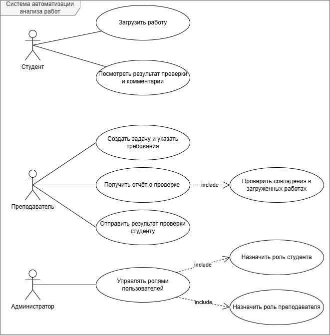

# Лабораторная работа №1

**Тема:** Формулирование требований к программной системе

**Цель работы:** Научиться анализировать поставленную задачу, формулировать функциональные и нефункциональные требования к проектируемой системе.

-----

## Перечень заинтересованных лиц (стейкхолдеров)

1. **Преподаватель**

   Основной пользователь системы. С помощью системы будет проверять работы студентов, получать отчеты, оставлять комментарии, формулировать требования к работам. Получает возможность сэкономить время.

2. **Студент**

   Загружает свои работы на проверку, затем получает обратную связь от преподавателя (например, рекомендации по работе). Получают возможность быстрее узнать рекомендации и оценку за работу.

3. **Разработчики**

   Разрабатывает и поддерживает систему, улучшает алгоритмы и оптимизирует быстродействие системы. Интегрируют новый функционал. Получают оплату за работу.

4. **Университет/учебный офис**

   Заинтересован в снижении нагрузки на преподавателей, повышении качества учебного процесса.

5. **Администратор системы**

   Управляет ролями пользователей, занимается мониторингом. Получает оплату за работу.

## Перечень функциональных требований

1. Создание и редактирование формальных требований преподавателями

   * система должна предоставлять возможность преподавателю создавать требования к проверке каждого созданного задания

2. Загрузка работы студента

   * система должна предоставлять возможность студенту загрузить свою работу - текст программы (файл или ввод текста в системе)

3. Автоматический анализ кода

   * система должна проверять соответствие работы формальным требованиям, заданным преподавателем
   * система должна анализировать стиль, форматирование, структуру работы

4. Формирование отчёта о проверке

   * отчёт должен содержать обнаруженные ошибки, рекомендации, указание на нарушение требований

5. Обратная связь для отправки студентам

   * преподаватель может заполнить отзыв и оценку работы и отправить его студенту
   * студент имеет возможность получить результаты анализа и комментарии

6. Сравнение работ студентов

   * система должна предоставлять возможность выявления совпадения в работах

7. Управление пользователями (администратор)

   * создание аккаунтов, присвоение ролей (преподаватель/студент), мониторинг системы

---

## Диаграмма вариантов использования

---

## Перечень сделанных предположений

1. Преподаватели формулируют требования к работам в текстовой форме.
2. Все студенты используют языки программирования, поддерживаемые системой.
3. Файлы решений студентов не содержат вредоносного кода.
4. Вычислительные ресурсы для обработки запросов предоставляются внешним сервисом.

---

## Перечень нефункциональных требований

1. **Производительность**

   * Время анализа одной работы не должно превышать 10 секунд при стандартной загрузке системы (не более 10 пользователей одновременно).
   * Параллельная обработка до 10 запросов без потери производительности.

2. **Надёжность**

   * В случае временной недоступности системы анализа, система должна обрабатывать действия пользователя.
   * В случае возникновения непредвиденных ошибок система должна обрабатывать их и уведомлять об этом пользователя.

3. **Удобство использования**

   * Интерфейс должен быть наглядным и структурированным, доступным для обычного пользователя ПК.
   * Интерфейс должен содержать минимум информации для достижения основной цели (загрузка, проверка работы).

4. **Безопасность**

   * Разграничение прав доступа (разные типы аккаунтов).
   * Передача данных по HTTPS.

5. **Масштабируемость**

   * Система должна иметь модульную архитектуру чтобы обеспечить эффективное исправление ошибок или добавления новых функций
   * Система должна поддерживать увеличение мощности сервера в случае нехватки производительности.
