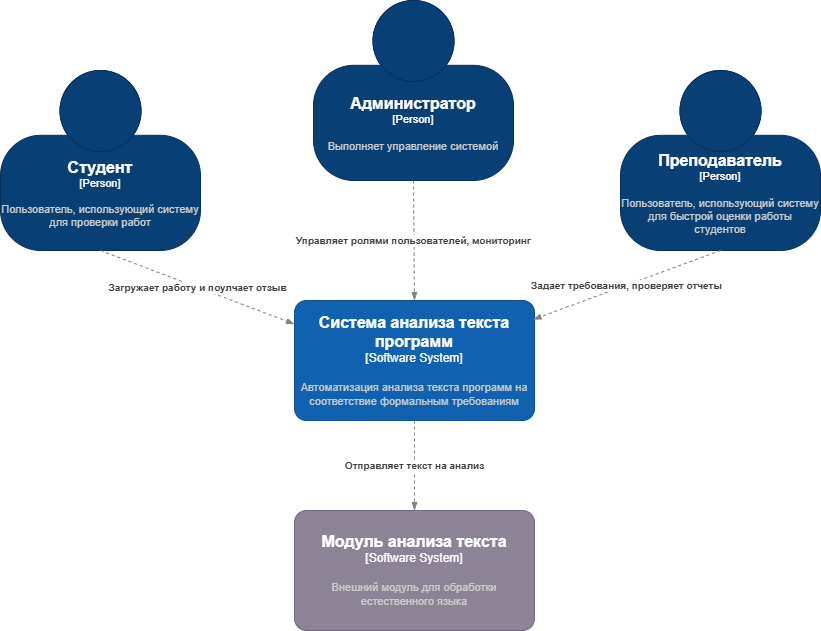
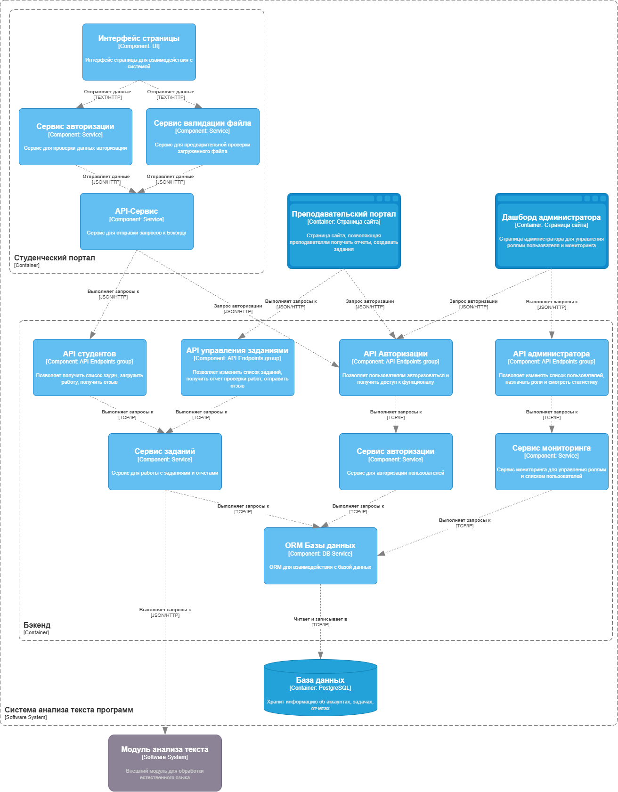

# **Лабораторная работа №2**

**Тема:** Использование нотации C4 model для проектирования архитектуры программной системы

**Цель:** Получить опыт использования графической нотации для фиксации архитектурных решений.

---

## Диаграмма системного контекста

**Описание основных элементов:**

* **Преподаватель** — задаёт требования, редактирует зададчи, просматривает отчёты.
* **Студент** — загружает работы и получает обратную связь.
* **Администратор** — управляет ролями и пользователями.
* **Система автоматизации анализа программ** — основная система.
* **Модуль анализа текста** — внешний сервис, который выполняет анализ текста.

---

## Диаграмма контейнеров

**Описание основных элементов:**

* **Студенческий, преподавательский портал и дашборд администратора** — интерфейсы (страницы сайта) для студентов, преподавателей и администратора соответственно.
* **Бэкенд** — основная логика системы (API), в т.ч. приём работ, построение отчётов, взаимодействие с базой данных.
* **База данных** — хранит пользователей, задания, загруженные работы, отчёты.
* **Модуль интеграции с генеративной моделью** — отдельный контейнер для отправки запросов в внешний ИИ-сервис.
* **Модуль анализа текста** — внешний сервис, который выполняет анализ текста.

### Архитектурный стиль

Выбран стиль клиент-серверной (распределенной) архитектуры

Это позволяет обеспечить масштабируемость системы, удобную интеграцию с внешними API.
Все ресурсоёмкие операции (анализ, создание отчета) будет выполнятся не на клиентской машине, а на сервере или внешнем сервисе, что позволяет улучшить пользовательский опыт.
---

## Диаграмма компонентов

Диаграмма показывает компоненты внутри контйенера Бэкенд.

## Описание компонентов

* **Студенческий, преподавательский портал и дашборд администратора** — интерфейсы (страницы сайта) для студентов, преподавателей и администратора соответственно.
* **API авторизации** — группа эндопинтов, отвечающая за авторизацию в системе для разделения прав доступа.
* **API администратора** — группа эндопинтов, отвечающая за управление пользователями и мониторинга системы администратором.
* **API студентов** — группа эндпоинтов, отвечающая за получение списка задач или обратной связи от преподавателя, загрузки работы студентами.
* **API управления заданиями** — группа эндпоинтов, отвечающая за редактирование списка задач, получение отчетов, отправку отзывов преподавателями.
* **Сервис отчетов** — сервис для генерации отчетов для преподавателей.
* **База данных** — хранит пользователей, задания, загруженные работы, отчёты.
* **Модуль анализа текста** — внешний сервис, который выполняет анализ текста.