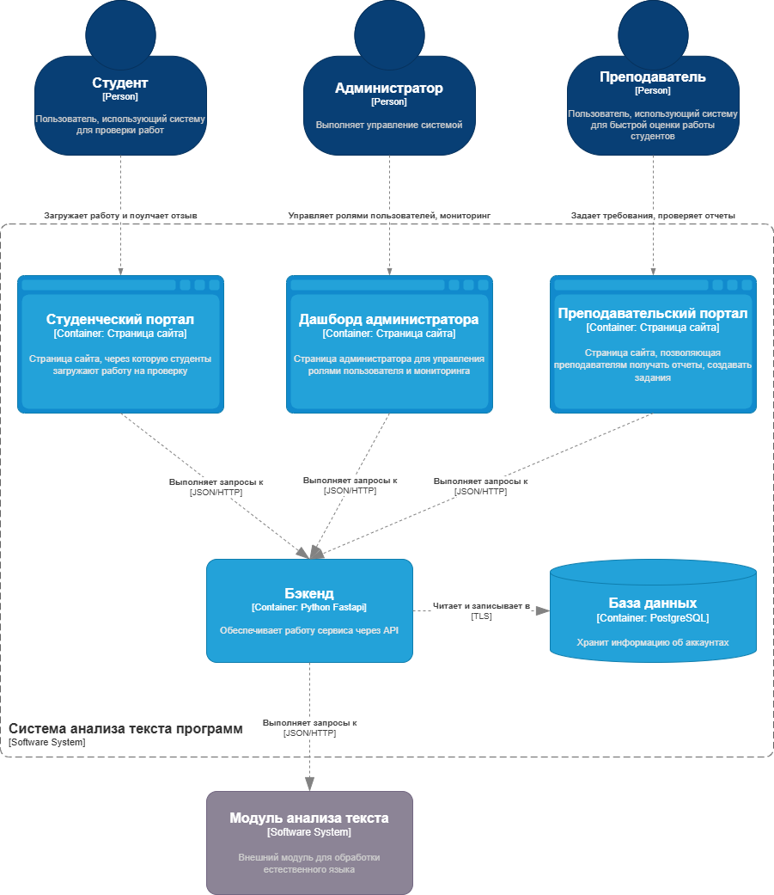
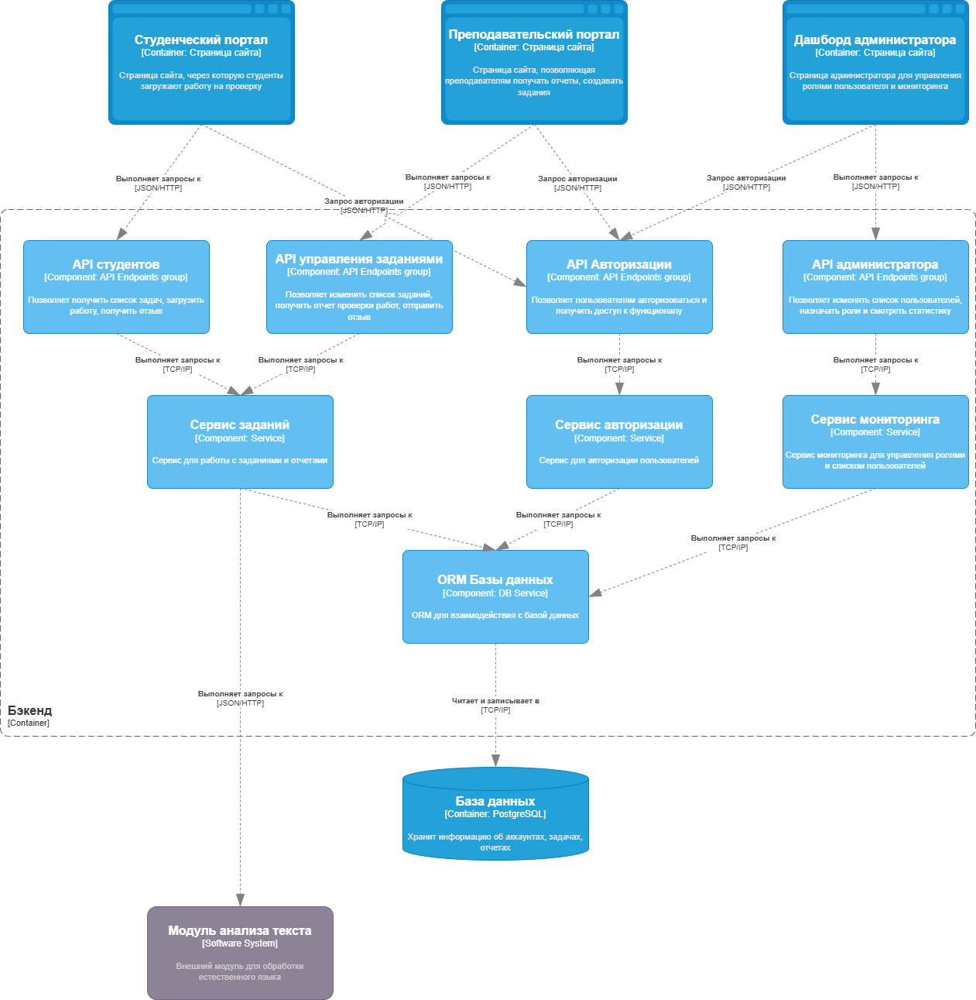
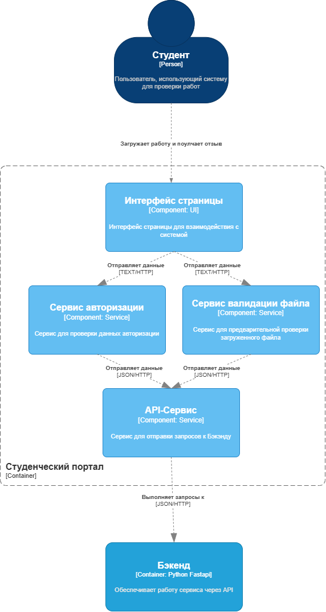
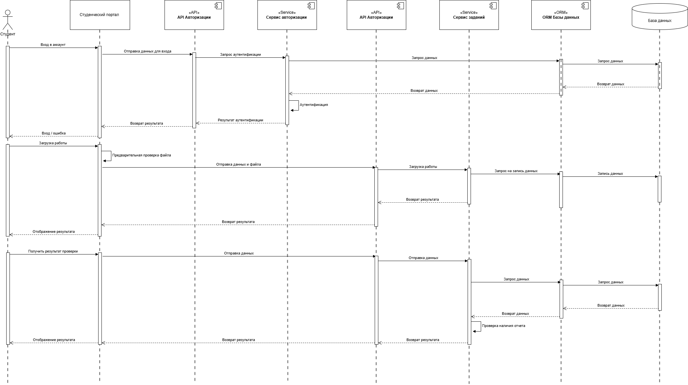
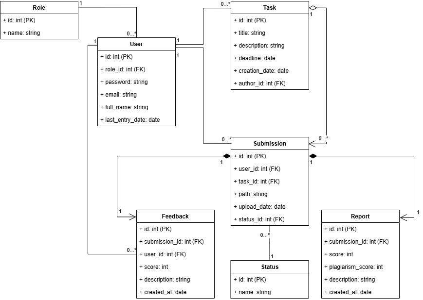

# **Лабораторная работа №3**

**Тема:** Использование принципов проектирования на уровне методов и классов

**Цель:** Получить опыт проектирования и реализации модулей с использованием принципов KISS, YAGNI, DRY, SOLID и др.

---

## Диаграмма контейнеров



## Диаграмма компонентов (Бэкенд)

Диаграмма показывает компоненты внутри контйенера Бэкенд.



### Описание компонентов для Бэкенд

* **Студенческий, преподавательский портал и дашборд администратора** — интерфейсы (страницы сайта) для студентов, преподавателей и администратора соответственно.
* **API авторизации** — группа эндопинтов, отвечающая за авторизацию в системе для разделения прав доступа.
* **API администратора** — группа эндопинтов, отвечающая за управление пользователями и мониторинга системы администратором.
* **API студентов** — группа эндпоинтов, отвечающая за получение списка задач или обратной связи от преподавателя, загрузки работы студентами.
* **API управления заданиями** — группа эндпоинтов, отвечающая за редактирование списка задач, получение отчетов, отправку отзывов преподавателями.
* **Сервис заданий** — сервис для управления, добавления заданий для студентов и преподавателей.
* **Сервис авторизации** — сервис для авторизации всех пользователей.
* **Сервис мониторинга** — сервис для мониторинга системы и управления пользователями для администратора.
* **ORM Базы данных** — ORM для взаимодействия с базой данных.
* **База данных** — хранит пользователей, задания, загруженные работы, отчёты.
* **Модуль анализа текста** — внешний сервис, который выполняет анализ текста.


## Диаграмма компонентов (Студенческий портал)

Диаграмма показывает компоненты внутри контйенера Студенческий портал.



### Описание компонентов для Студенческого портала

* **Интерфейс страницы** — интерфейс для взаимодействия с системой.
* **Сервис авторизации** — сервис для обработки данных авторизации.
* **Сервис валидации файла** — сервис для предварительной проверки формата файла.
* **API-сервис** — сервис для отправки запросов на бэкенд мониторинга системы и управления пользователями для администратора.

## Диаграмма последовательностей

**В качестве варианта использования для демонстрации выбраны действия студента по загрузке работ и получении обратной связи**



На диаграмме всего три варианта  использования:

* Авторизация
* Загрузка работы
* Получение результатов

## Модель БД



Всего 7 сущностей:
* Пользователь (user)
* Задание (task)
* Ответ на задание (submission)
* Отчет системы (report)
* Отзыв преподавателя (feedback)
* Роли пользователей (role)
* Статусы ответов на задание (status) 

## Применение основных приницпов разработки

### 1. KISS

Каждый эндпоинт реализует одну функцию с явным названием и логичным действием.
Нет сложной логики в эндпоинтах.

Например, эндпоинт для загрузки работы студента.

```python
# Create submission
@router.post("/submissions", response_model = SubmissionCreated)
async def create_submission(task_id: int, file: UploadFile, payload: dict = Depends(verify_token), db: AsyncSession = Depends(get_db)):
    user = await get_user_by_id_db(db, payload.get("user_id"))
    if not user:
        raise HTTPException(status_code=404, detail="User not found")

    return {"id": user.id, "role": user.role.name,"task_id": task_id, "file_name": file.filename, "status": "Submitted successfully"}
```

### 2. YAGNI

Этот принцип реализуется благодаря наличию только нужных элементов, например:

* нет сервисов просто ради сервисов
* нет проверки данных на каждом этапе, всё выполняется автоматически через pydantic - модели

### 3. DRY

Например, выделен auth_service, включающий основные функции для авторизации.

```python
# Checking role
def verify_admin(payload: dict = Depends(verify_token)):
    role = payload.get("role")
    if role != "ADMIN":
        raise HTTPException(status_code=403, detail="Forbidden - admin role required")
    return payload

# Checking role
def verify_teacher(payload: dict = Depends(verify_token)):
    role = payload.get("role")
    if role != "TEACHER":
        raise HTTPException(status_code=403, detail="Forbidden - admin role required")
    return payload
```

### 4. SOLID

#### S — Single Responsibility Principle (SRP)

Например, роутеры (группы эндпоинтов) разбиты на отдельные файлы.

* `students.py` — только студент
* `auth.py` — только аутентификация
* `teachers.py` — только преподаватели
* `admin.py` — только админы

Каждый сервис отвечает за свою функцию. 

Так, auth_service выполняет только функции, связанные с безопасность.

#### O — Open / Closed Principle (OCP)

Для добавления новых эндпоинтов/функций проверки, не нужно менять существующий код, можно просто добавить новый.

```python
def verify_admin(...)
def verify_teacher(...)
```

Например тут, в auth_service можно добавить `verify_student`, не меняя остальной код

#### L — Liskov Substitution Principle (LSP)

Сам проект реализуется методом функционального программирования, поэтоу ООП почти не используется.

Но, например, схемы для проверки валидности входных/выходных данных Pydantic наследуются от базового класса и только расширяют его.

```python
from pydantic import BaseModel, EmailStr
from datetime import datetime

class SubmissionBase(BaseModel):
    pass

class SubmissionCreated(BaseModel):
    id: int
    task_id: int
    status: str
    upload_date: datetime
```

#### I — Interface Segregation Principle (ISP)

* отсутствуют большие зависимости (изменения в одном слое не влияют на остальные)
* функции принимают только нужные параметры


#### D — Dependency Inversion Principle (DIP)

Например, роутеры не знают какая реализация БД (не взаимодействует с ней напрямую, только через ORM)

Функции безопасности автоматически подключены к эндпоинтам через зависиомсти (Depens)


```python
async def create_submission(task_id: int, file: UploadFile, payload: dict = Depends(verify_token), db: AsyncSession = Depends(get_db)):
```

### 5. BDUF — Big Design Up Front
Масштабное проектирование прежде всего

### Суть принципа

BDUF это детальная проработка архитектуры системы до начала реализации.

**В проекте принцип применён не полностью**

Разработаны:

* диаграмма системного контекста (C4 Context);
* диаграмма контейнеров;
* диаграмма компонентов;
* модель данных (ER / классы).

Однако, архитектура не полная, так как требования могут уточняться в ходе выявления требований, а также детализация на начальном этапе может привести к избыточности работ.


### 6. SoC — Separation of Concerns

Принцип разделения ответственности

Этот принцип применён и также продемонстрирован в разделе SOLID (Single Responsibility Principle)

Проект разделен на:

* **routers** — обработка HTTP-запросов;
* **services** — бизнес-логика (аутентификация, безопасность);
* **crud** — доступ к данным и работа с БД;
* **schemas** — валидация входных и выходных данных;
* **models** — ORM-модели базы данных.


### 7. MVP — Minimum Viable Product

Минимально жизнеспособный продукт


Этот принцип предполагает реализацию минимального набора функций, достаточного для выполнения основных сценариев использования.

Принцип применён, т.к. проект учебный и должен реализовывать основную идею без дополнительного функционала. Отсуствует излишние дополнения  и т.п. 

Этот принцип также показан в разделе 2 (YAGNI).


### 8. PoC — Proof of Concept

Доказательство концепции

Принцип подразумевает проверку технической реализуемости идеи, в ущерб качественному коду или архитектуре.

Принцип не применяется в проекте, так как реализуется структурированный проект, соблюдаются архитектурные решения, используется разделение ответственности. 
