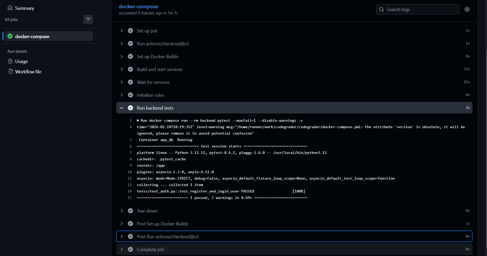

# **Лабораторная работа №5**

**Тема:** Реализация архитектуры на основе сервисов (микросервисной архитектуры)

**Цель:** Получить опыт работы организации взаимодействия сервисов с использованием контейнеров Docker.

---
Согласно диаграмме контейнеров реализовать в отдельности каждый контейнер и настроить между ними взаимодействие. Выделить минимум 3 контейнера: клиентская часть, серверная часть и БД. Запустить контейнеры, показать работоспособность приложения, состоящего из взаимодействующих сервисов (запускать можно локально или на удаленной машине).
(4 балла)
Настроить непрерывную интеграцию (сборку приложения и создание docker-образов). 
(2 балла)
Разработать интеграционные тесты и включить их в процесс непрерывной интеграции (можно подключить тесты, ранее созданные в Postman).
(2 балла)

### Реализация контейнеров

Для начала был реализован демонстрационный интерфейс, чтобы подключить его к бекэнду.

#### Dockerfile для backend
Далее был реализован основной Dockerfile для контейнера Бекэнд:
```dockerfile
FROM python:3.12-slim

WORKDIR /app

COPY app/requirements.txt .
RUN pip install --no-cache-dir -r requirements.txt

COPY . .

CMD ["uvicorn", "app.main:app", "--host", "0.0.0.0", "--port", "8000"]

```

Здесь копируются файлы, устанавливаются зависимости и запускается контейнер.

Чтобы настроить взамиодействие между контейнерами, был создан файл docker-compose, запускающий все сервисы вместе:

#### Docker-compose

```dockerfile
version: "3.9"

services:
  db:
    image: postgres:15
    container_name: app_db
    restart: always
    ports:
      - "5433:5432"
    volumes:
      - postgres_data:/var/lib/postgresql/data

  backend:
    build: .
    container_name: app_backend
    restart: always
    depends_on:
      - db
    env_file:
      - .env
    ports:
      - "8000:8000"

  web:
    image: nginx:alpine
    container_name: app_web
    ports:
      - "8080:80"
    volumes:
      - ./web/index.html:/usr/share/nginx/html/index.html
      - ./web/nginx.conf:/etc/nginx/conf.d/default.conf
    depends_on:
      - backend

  test:
    build: .
    container_name: app_tests
    depends_on:
      - backend
    env_file:
      - .env
    command: pytest --maxfail=1 --disable-warnings -v

volumes:
  postgres_data:

```

Здесь описаны запуски контейнеров для Web-интерфейса, базы данных и бекэнда.
Также описан отдельный сервис для запуска тестов.

С его помощью все контейнеры запускаются вместе и связаны друг с другом в одной сети контейнеров.


Также был добавлен простой тест на авторизацию с помощью Pytest:

```python
from datetime import datetime
import pytest

URL =  "/api/v1/auth"

from httpx import AsyncClient, ASGITransport

async def register_user(client, email="user12345@test.com", password="secret", admin_key = None):
    return await client.post(URL+"/register", json={
        "email": email,
        "password": password,
        "admin_key": admin_key,
        "full_name": "Test Test",
    })

async def login_user(client, email="user12345@test.com", password="secret"):
    return await client.post(URL+"/login", json={
        "email": email,
        "password": password,
    })

# Simple auth test
@pytest.mark.asyncio
async def test_register_and_login_user(client):
    email = f"user{datetime.now().strftime("%d.%H.%M.%S")}@test.com"

    resp = await register_user(client, email=email, password="test")
    assert resp.status_code == 200

    login = await login_user(client, email=email, password="test")
    assert login.status_code == 200

    tokens = login.json()
    assert "access_token" in tokens and "refresh_token" in tokens


```
### Автоматическая интеграция

Чтобы продемонстрировать этот процесс, было создано описание CI/CD процесса для Github Actions.

```commandline
name: CI/CD Demo

on:
  push:
    branches: [main]

jobs:
  docker-compose:
    runs-on: ubuntu-latest

    steps:
      - uses: actions/checkout@v3

      - name: Set up Docker Buildx
        uses: docker/setup-buildx-action@v2

      - name: Build and start services
        run: docker compose up -d --build

      - name: Wait for services
        run: |
          echo "Waiting 10 seconds for services to be ready..."
          sleep 15

      - name: Initialize roles
        run: |
          docker cp ./init_roles.sql app_db:/init_roles.sql
          docker exec -i app_db psql -U postgres -d db -f /init_roles.sql

      - name: Run backend tests
        run: docker compose run --rm backend pytest --maxfail=1 --disable-warnings -v

      - name: Tear down
        run: docker compose down

```

Этот файл описывает последовательность действий, которые запускают контейнеры на сервере, выполняют тесты и затем завершают работу. Это нужно для демонстрации работы.

Результат выполнения в репозитории:




