# **Лабораторная работа №6**

**Тема:**  Использование шаблонов проектирования

**Цель:** Получить опыт применения шаблонов проектирования при написании кода программной системы

---

# Порождающие шаблоны
## 1. Factory Method

### Общее назначение

Определяет интерфейс создания объекта, позволяя подклассам решать, какой класс инстанцировать.

### Назначение в проекте

Создание пользователей с разными ролями (Admin, Student) через фабрику.

### UML

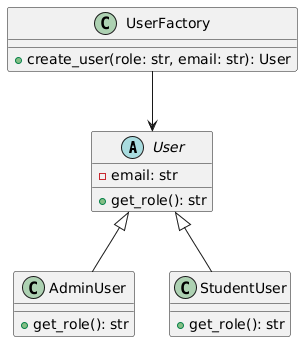

### Пример

```python
from abc import ABC, abstractmethod

class User(ABC):
    def __init__(self, email: str):
        self.email = email

    @abstractmethod
    def get_role(self) -> str:
        pass


class AdminUser(User):
    def get_role(self) -> str:
        return "admin"


class StudentUser(User):
    def get_role(self) -> str:
        return "student"
```

```python
# factories/user_factory.py
class UserFactory:
    @staticmethod
    def create_user(role: str, email: str) -> User:
        if role == "admin":
            return AdminUser(email)
        elif role == "student":
            return StudentUser(email)
        raise ValueError("Unknown role")
```

---

## 2. Singleton

### Общее назначение

Гарантирует существование единственного экземпляра класса.

### В проекте

Менеджер подключения к БД.


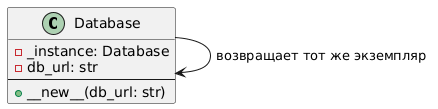

### Код

```python
# core/database.py
class Database:
    _instance = None

    def __new__(cls, db_url: str):
        if cls._instance is None:
            cls._instance = super().__new__(cls)
            cls._instance.db_url = db_url
        return cls._instance
```

---

## 3. Builder

### Общее назначение

Пошаговое создание сложного объекта.

### В проекте

Создание JWT токена.


### UML

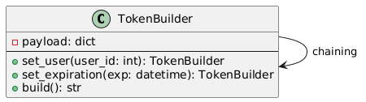


### Код

```python
class TokenBuilder:
    def __init__(self):
        self.payload = {}

    def set_user(self, user_id: int):
        self.payload["sub"] = user_id
        return self

    def set_expiration(self, exp):
        self.payload["exp"] = exp
        return self

    def build(self):
        import jwt
        return jwt.encode(self.payload, "SECRET", algorithm="HS256")
```


# Структурные шаблоны

---

## 1. Adapter

### Назначение

Позволяет несовместимым интерфейсам работать вместе.

### В проекте

Адаптация ORM модели к DTO.

### UML

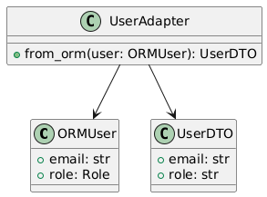


### Код

```python
class UserDTO:
    def __init__(self, email: str, role: str):
        self.email = email
        self.role = role


class UserAdapter:
    @staticmethod
    def from_orm(user):
        return UserDTO(
            email=user.email,
            role=user.role.name
        )
```

---

## 2. Decorator

### Назначение

Динамически добавляет поведение объекту.

### В проекте

Проверка роли пользователя.

### UML

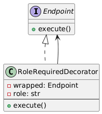


### Код

```python
from functools import wraps
from fastapi import HTTPException

def role_required(role: str):
    def decorator(func):
        @wraps(func)
        async def wrapper(*args, **kwargs):
            user = kwargs.get("current_user")
            if user.role != role:
                raise HTTPException(status_code=403)
            return await func(*args, **kwargs)
        return wrapper
    return decorator
```

---

## 3. Facade

### Назначение

Упрощает сложную подсистему.

### В проекте

AuthService как фасад над hashing + jwt + repository.


### UML

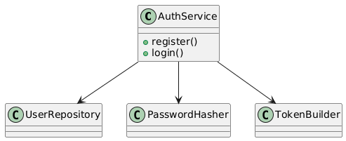


### Код

```python
class AuthService:
    def __init__(self, repo, hasher):
        self.repo = repo
        self.hasher = hasher

    async def register(self, email, password):
        hashed = self.hasher.hash(password)
        return await self.repo.create(email, hashed)
```

---

## 4. Proxy

### Назначение

Контролирует доступ к объекту.

### В проекте

Lazy DB Repository.


### UML

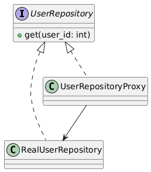


```python
class UserRepositoryProxy:
    def __init__(self, real_repo):
        self._real_repo = real_repo

    async def get(self, user_id):
        print("Logging access")
        return await self._real_repo.get(user_id)
```

# Поведенческие шаблоны

---

## 1. Strategy

### Назначение

Инкапсулирует алгоритмы.

### В проекте

Разные стратегии хеширования. Можно расширять.

### UML

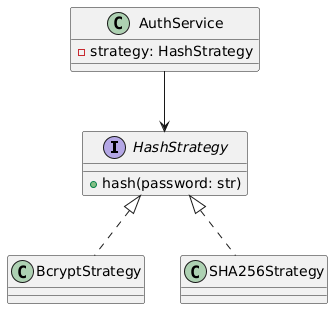


```python
class HashStrategy:
    def hash(self, password: str):
        pass


class BcryptStrategy(HashStrategy):
    def hash(self, password: str):
        import bcrypt
        return bcrypt.hashpw(password.encode(), bcrypt.gensalt())
```

---

## 2. Observer

### Назначение

Подписка на события.

### В проекте

Отслеживание процесса проверки.

### UML

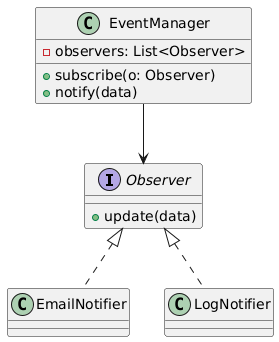


```python
class EventManager:
    def __init__(self):
        self.subscribers = []

    def subscribe(self, listener):
        self.subscribers.append(listener)

    def notify(self, data):
        for sub in self.subscribers:
            sub.update(data)
```

---

## 3. Command

### Назначение

Инкапсулирует запрос как объект.

### В проекте

Отдельный класс для создания пользователя (команда).

### UML

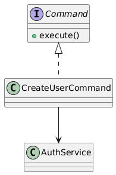

```python
class CreateUserCommand:
    def __init__(self, service, email, password):
        self.service = service
        self.email = email
        self.password = password

    async def execute(self):
        return await self.service.register(self.email, self.password)
```

---

## 4. Template Method

### Назначение

Определяет скелет алгоритма (интерфейс). 

---

### UML

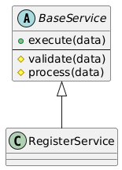

```python
from abc import ABC, abstractmethod

class BaseService(ABC):
    async def execute(self, data):
        self.validate(data)
        return await self.process(data)

    @abstractmethod
    def validate(self, data):
        pass

    @abstractmethod
    async def process(self, data):
        pass
```

---

## 5. State

### Назначение

Изменяет поведение при смене состояния.

### В проекте

Статусы пользователя: Active / Blocked.

### UML

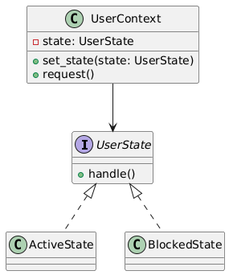

```python
class UserState:
    def handle(self):
        pass


class ActiveState(UserState):
    def handle(self):
        return "User active"


class BlockedState(UserState):
    def handle(self):
        return "User blocked"
```